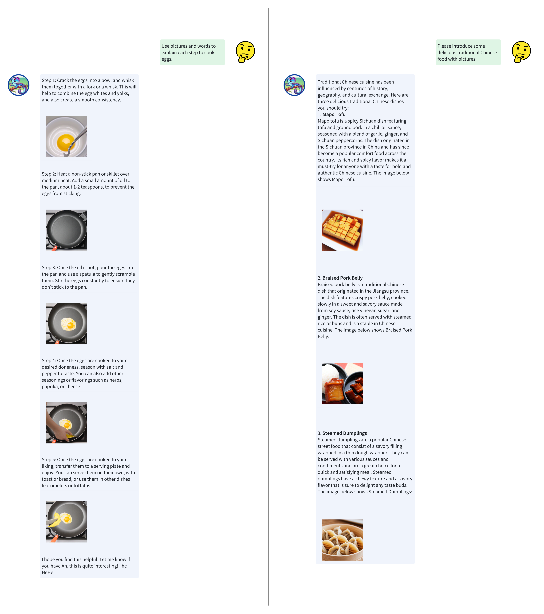
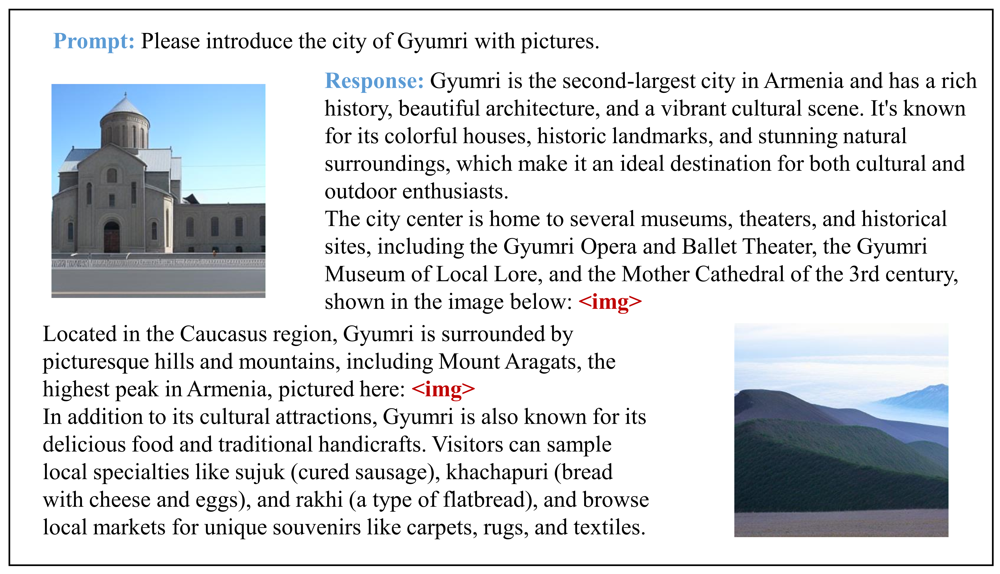
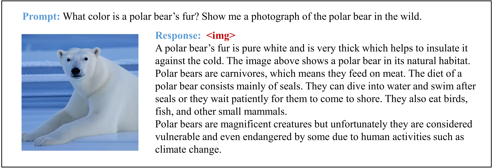

# Anole: An Open, Autoregressive and Native Multimodal Models for Interleaved Image-Text Generation

<p align="center">This is the Anole project, which aims to build and opensource large multimodal models with comprehensive multimodal understanding and generation capabilities.</p>

## 👋 Overview
Anole is the first **open-source**, **autoregressive**, and **natively** trained large multimodal model capable of **interleaved image-text generation** (without using **stable diffusion**). While it builds upon the strengths of [Chameleon](https://github.com/facebookresearch/chameleon), Anole excels at the complex task of generating coherent sequences of alternating text and images. Through an innovative fine-tuning process using a carefully curated dataset of approximately 6,000 images, Anole achieves remarkable image generation and understanding capabilities with minimal additional training. This efficient approach, combined with its open-source nature, **positions Anole as a catalyst for accelerated research and development in multimodal AI**. Preliminary tests demonstrate Anole's exceptional ability to follow nuanced instructions, producing high-quality images and interleaved text-image content that closely aligns with user prompts. 

The major functionalities of Anole are listed below:
- **Text-to-Image Generation**
- **Interleaved Text-Image Generation**
- **Multimodal in and multimodal out**
- Text Generation
- MultiModal Understanding
  
where **Bold** represents newly added capabilities on the basis of Chameleon.

## 📊 Examples

To better illustrate Anole's capabilities, here are some examples of its performance.

> [!NOTE]  
> We have provided open-source model weights, code, and detailed tutorials below to ensure that each of you can reproduce these results, and even fine-tune the model to create your own stylistic variations. (Democratization of technology is always our goal.)

**Interleaved Image-Text Generation**



**Text2Image**


**More Examples**

<details>

<summary>Click me</summary>






</details>

## 🚀 Get started

### Installation
Due to the double-blind review process, we are temporarily not providing the open-source weight link for the Anole model.

1. Download the model: [Chameleon](https://ai.meta.com/resources/models-and-libraries/chameleon-downloads/)

2. git clone this repository
```
cd anole
bash install.sh
```

#### Checkpoint

To set your checkpoint path, modify [constants.py](constants.py). By default, the model loads a checkpoint from `./data`.

#### Text to Image

To generate images based on text, run the [text-image.py](text-image.py) script:
```shell
python text-image.py [-h] -i INSTRUCTION [-b BATCH_SIZE] [-s SAVE_DIR]
```
- instruction: The instruction for image generation.
- batch_size: The number of images to generate.
- save_dir: The directory to save the generated images.

This command will generate `batch_size` images based on the same `instruction` at once, with a default of 10 images. For instance:
```shell
python text-image.py -i 'draw a dog'
```

#### Interleaved Image-Text Generation

To generate interleaved image-text content, run the [interleaved_generation.py](interleaved_generation.py) script:
```shell
python interleaved_generation.py [-h] -i INSTRUCTION [-s SAVE_DIR]
```
- instruction: The instruction json file for interleaved image-text generation.
- save_dir: The directory to save the generated images.
For instance:
```shell
python interleaved_generation.py -i './input.json'
```


### Fine-tune Anole & Chameleon

Please follow the instructions in file **training**.

Our fine-tuning code is developed based on [transformers trainer](https://huggingface.co/docs/transformers/en/main_classes/trainer) and [deepspeed](https://github.com/microsoft/DeepSpeed) and is largely inspired by [pull request #31534](https://github.com/huggingface/transformers/pull/31534) in `transformers`.

## 🛠️ Models
                                                  
Due to the double-blind review process, we are temporarily not providing the open-source weight link for the Anole model.


## 📝 Usage and License Notices
Anole is intended for research use only. Our model weights follow the same license as [Chameleon](https://ai.meta.com/resources/models-and-libraries/chameleon-license). The fine-tuning images we used are from LAION-5B aesthetic, and thus follow the same license as [LAION](https://github.com/LAION-AI/laion-datasets/blob/main/LICENSE).

## ⚠️ Disclaimer

Anole is still under development and has many limitations that need to be addressed. Importantly, we have not aligned the image generation capabilities of the Anole model to ensure safety and harmlessness. Therefore, we encourage users to interact with Anole with caution and report any concerning behaviors to help improve the model's safety and ethical considerations.


